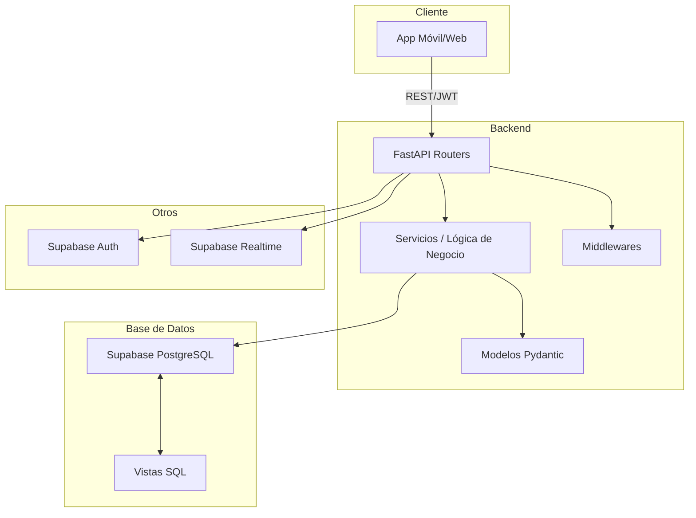

# Arquitectura de la API StudyVault

## 🏗️ Descripción General

La API de StudyVault es el núcleo backend de una plataforma de productividad estudiantil, diseñada para ser robusta, escalable y fácil de mantener. Permite gestionar usuarios, tareas, eventos de calendario, calificaciones y notificaciones, integrando lógica de negocio, seguridad y acceso eficiente a datos.

---

## ⚙️ Stack Tecnológico

- **Framework Backend:** FastAPI (Python)
- **Base de Datos:** Supabase (PostgreSQL gestionado)
- **Autenticación:** JWT + Supabase Auth
- **Despliegue:** Railway
- **Tiempo Real:** Supabase Realtime

---

## 📂 Estructura del Proyecto

```text
Api-Study/
│
├── app/            # Código principal de la API
│   ├── routers/    # Endpoints organizados por dominio (auth, calendar, grades, etc.)
│   ├── models/     # Modelos Pydantic y ORM
│   ├── services/   # Lógica de negocio y acceso a datos
│   └── utils/      # Utilidades y helpers
│
├── sql/            # Scripts y vistas SQL
├── tests/          # Pruebas unitarias y de integración
├── requirements.txt# Dependencias de Python
├── Procfile        # Configuración para despliegue en Railway
├── railway.json    # Configuración Railway
└── main.py         # Punto de entrada de la aplicación
```

---

## 🧩 Componentes Principales

- **Routers:** Cada dominio funcional (usuarios, tareas, calendario, calificaciones, notificaciones) tiene su propio router en `app/routers/`, facilitando la organización y escalabilidad.
- **Modelos:** Los modelos Pydantic definen la validación y serialización de datos, mientras que los modelos ORM (si se usan) permiten el mapeo a la base de datos.
- **Servicios:** Encapsulan la lógica de negocio y el acceso a datos, desacoplando los endpoints de la lógica interna.
- **Vistas SQL:** Se utilizan vistas complejas en Supabase para exponer datos agregados y relaciones, optimizando el rendimiento y simplificando el frontend.
- **Middlewares:** Incluyen autenticación JWT, manejo de CORS y logging.

---

## 🔄 Flujo de Datos y Seguridad

1. **Autenticación:**
   - El usuario se registra o inicia sesión mediante endpoints de `/auth`.
   - Se utiliza Supabase Auth para la gestión de usuarios y emisión de tokens JWT.
   - Los endpoints protegidos requieren un JWT válido, verificado por middleware.

2. **Gestión de Recursos:**
   - Los routers exponen endpoints RESTful para tareas, eventos, calificaciones, etc.
   - Cada petición valida el usuario autenticado y filtra los datos por `user_id`.

3. **Consultas Eficientes:**
   - Se aprovechan vistas SQL (`vw_calendar_with_grades`, `vw_grades_by_category`, etc.) para entregar datos agregados y relaciones complejas en una sola consulta.

4. **Notificaciones y Tiempo Real:**
   - Supabase Realtime permite notificar cambios relevantes (nuevas tareas, eventos, etc.) a los clientes conectados.

5. **Despliegue y Variables de Entorno:**
   - El despliegue se realiza en Railway, usando variables de entorno para credenciales y configuración.

---

## 🗂️ Ejemplo de Diagrama de Carpetas

```text
app/
├── routers/
│   ├── auth.py
│   ├── calendar.py
│   ├── grades.py
│   └── ...
├── models.py
├── services/
├── utils/
└── ...
```

---

## 🛡️ Buenas Prácticas

- Código modular y desacoplado.
- Uso de vistas SQL para optimizar consultas y reducir lógica en el backend.
- Validación estricta de datos con Pydantic.
- Pruebas automatizadas para endpoints críticos.
- Separación clara entre modelos, lógica de negocio y rutas.
- Manejo seguro de claves y variables de entorno.

---

## 📑 Documentación y Endpoints

- **Documentación interactiva:** `/docs` (Swagger UI)
- **Health check:** `/health`
- **Endpoints principales:**
  - `/auth` (registro, login, reset password)
  - `/tasks`, `/calendar`, `/grades`, `/notifications`, `/user-profiles`, etc.
- **Vistas SQL expuestas:**
  - `/vw/calendar-with-grades`
  - `/vw/grades-by-category`
  - `/vw/grades-by-course`
  - `/vw/calendar-grades-linked`

---

## 🔗 Integración con Supabase

- **Supabase Auth:** Gestión de usuarios y autenticación JWT.
- **Supabase Database:** PostgreSQL gestionado, con vistas y funciones SQL para lógica avanzada.
- **Supabase Realtime:** Notificaciones en tiempo real para cambios en datos relevantes.

---

## 🚀 Despliegue

El despliegue se realiza en Railway, que detecta automáticamente el entorno Python y ejecuta la aplicación usando el archivo Procfile. Las variables de entorno necesarias se configuran en el dashboard de Railway.

---

## 🧠 Resumen Visual de la Arquitectura



---

## 📬 Contacto

Para dudas o contribuciones, contacta al equipo de desarrollo o revisa la documentación adicional en los archivos del proyecto.
